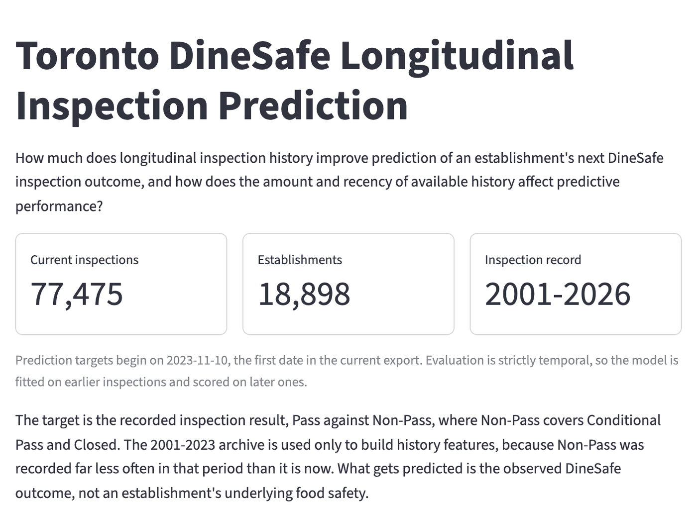
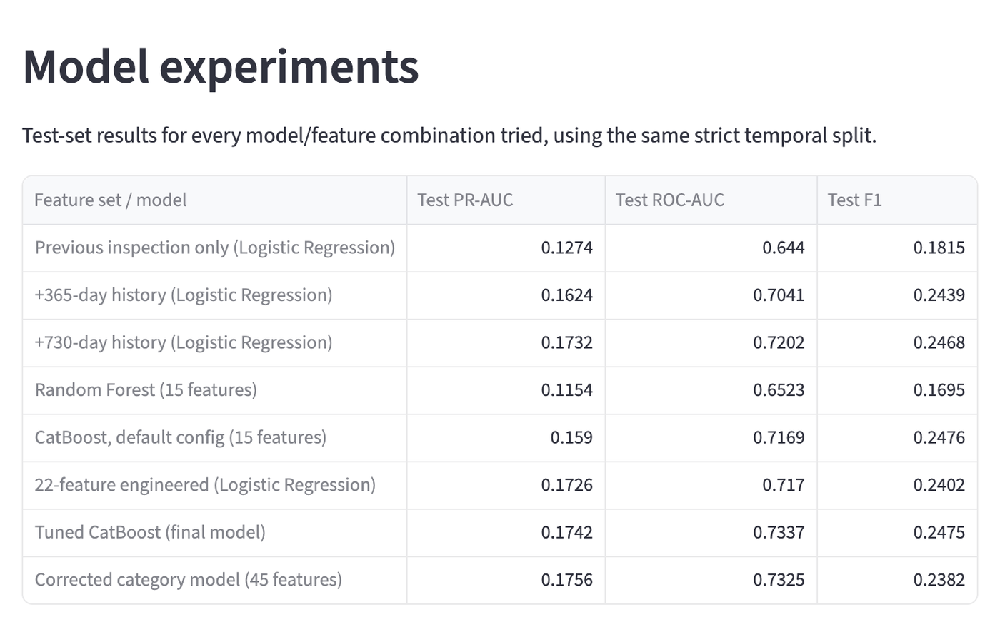
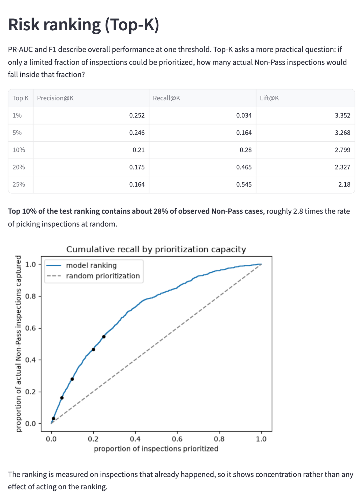
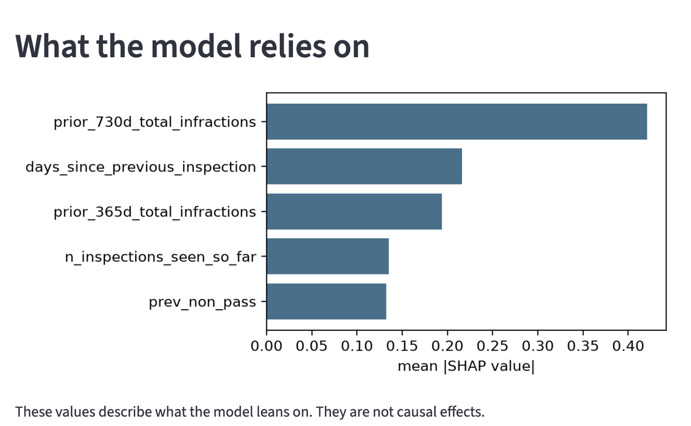

# Toronto DineSafe Longitudinal Inspection Prediction

A research project on Toronto's public DineSafe restaurant inspection data, looking at whether an establishment's past inspection history helps predict the outcome of its next inspection.

Live dashboard: https://toronto-dinesafe-ml.streamlit.app/

Literature review: [literature_review/DineSafe_Literature_Review.pdf](literature_review/DineSafe_Literature_Review.pdf). Written during the project to guide the study design, tidied up in September 2026.

If the app has been asleep, click "Yes, get this app back up!" and give it about a minute to load. These screenshots show what it looks like:

**Overview**

**Model experiments**

**Risk ranking (Top-K)**

**What the model relies on**

## Research question

How much does longitudinal inspection history improve prediction of an establishment's next DineSafe inspection outcome, and how does the amount and recency of available history affect predictive performance?

## Data and target

The current DineSafe export (`Dinesafe.csv`) is infraction-row level, meaning one inspection can span several rows. It had to be audited and reconstructed into actual inspection-level records before any modelling could start (see `docs/DATA_AUDIT.md` and `docs/DATA_RECONSTRUCTION.md`). A historical archive (`Dinesafe Historical Data.zip`, 2001-2023) was combined with it. Neither source file was ever modified.

The target is Pass (0) versus Non-Pass (1, meaning Conditional Pass or Closed). Only current-period inspections (2023-11-10 onward) are used as prediction targets. The historical archive is used only to build history features for those targets, because Non-Pass rates in the historical period look structurally different from the current period (see `docs/TEMPORAL_DISTRIBUTION_CHECK.md`).

The model predicts the recorded DineSafe outcome for an inspection, not an establishment's underlying food safety.

## Method

The split is strict and date ordered, not random. Train covers the earliest target inspections (2023-11-10 to 2025-11-05), validation the next period (2025-11-06 to 2026-04-09), and test the most recent period (2026-04-10 to 2026-09-08). The same establishment can show up in more than one split, since the task is forecasting a later inspection using only what was already known about that establishment beforehand.

## Results

The final feature set has 15 longitudinal features built from an establishment's own history: the previous inspection, plus 365-day and 730-day rolling windows. With a tuned CatBoost model this reaches a test PR-AUC around 0.174 and ROC-AUC around 0.734. At a decision threshold of 0.70, chosen on validation before the test set was touched, precision, recall, and F1 are all modest, which is expected given Non-Pass is only about 7.5% of the test period. Most of the PR-AUC gain comes from the most recent year of history. A second year, some engineered rate features, more complex models, and a fuller infraction-category representation were all tried and added little on top of that.

Ranked by predicted risk, the top 10% of test-set inspections contains about 28% of the actual Non-Pass cases, so the ranking has some real value even though PR-AUC on its own looks modest. The raw predicted probabilities are not well calibrated, so the scores work better for ranking establishments than for reading off as a literal chance of Non-Pass.

## Repository

- `docs/FINAL_RESEARCH_SUMMARY.md` - the full write-up
- `docs/FINAL_RESULTS_TABLE.md` - compact results table
- `docs/NOTEBOOK_GUIDE.md` - one line per notebook
- `notebooks/` - all 16 research notebooks, in the order the work was done
- `outputs/` - saved result CSVs and figures used throughout the docs and the dashboard
- `app.py` - the Streamlit dashboard, which only reads saved results and never retrains anything

To run the dashboard locally: `pip install -r requirements.txt` then `streamlit run app.py`.

## Reproducibility

The raw DineSafe export and the historical ZIP are not in this repo. They are large and are public data anyway, available from the [Toronto Open Data DineSafe page](https://open.toronto.ca/dataset/dinesafe/). A few large intermediate tables built from them are also left out for the same reason. What is included is everything the dashboard needs (the small result CSVs and figures in `outputs/`) along with all 16 notebooks, whose saved outputs can be read directly on GitHub without running anything.

That also means the notebooks cannot be re-run straight from a clean clone. Every notebook reads one of the excluded intermediate files, and notebooks 13 and 14 read `Dinesafe.csv` directly. To rebuild the pipeline from scratch, download `Dinesafe.csv` and the historical ZIP from Toronto Open Data, put them in the project root, run `build_longitudinal_dataset.py` to regenerate the intermediate tables, then run the notebooks in order.
